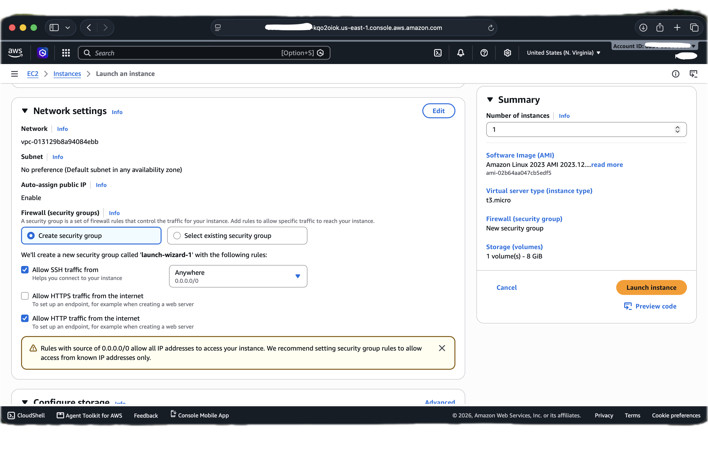
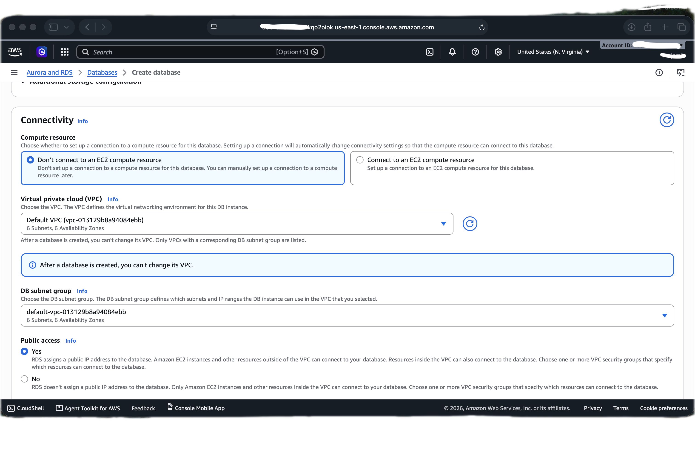
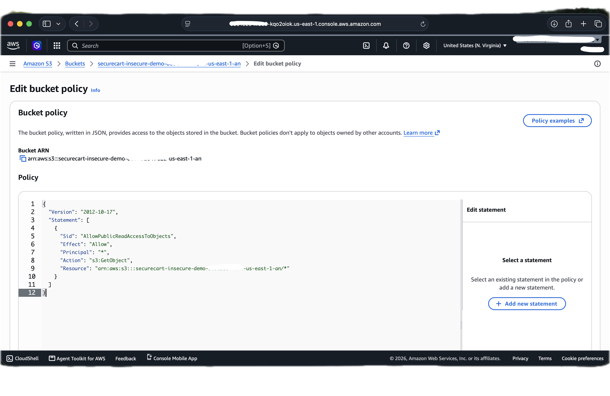
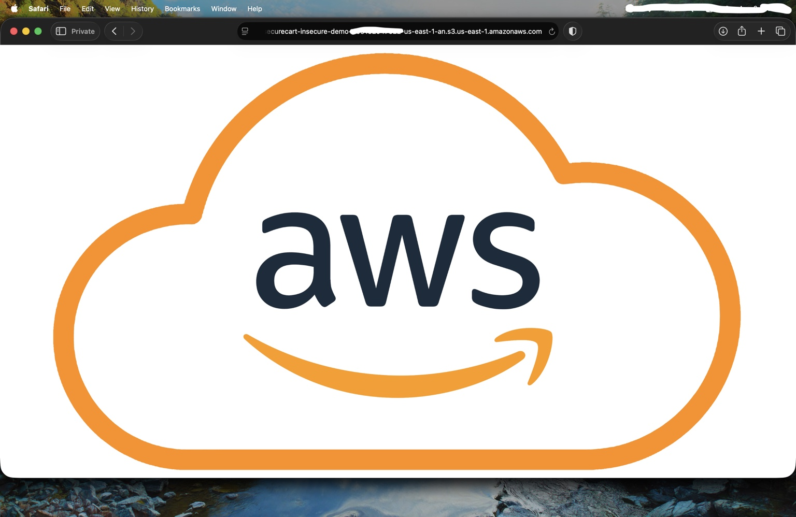
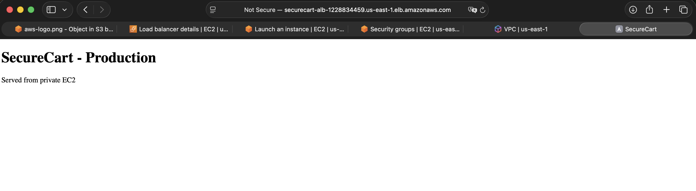

# SecureCart - Secure AWS Architecture

A personal AWS cloud security project documenting the difference between an intentionally insecure cloud deployment and a redesigned, security-focused architecture.

This repository is **documentation of a hands-on lab**, not a software product. The purpose is to show how common AWS misconfigurations can expose an application and its data, then demonstrate how the same environment can be rebuilt with stronger network segmentation, least-privilege security groups, private backend resources, encrypted storage, and AWS WAF.

**Region used:** `us-east-1` (N. Virginia)  
**Scenario:** SecureCart, a small e-commerce-style web application  
**Project type:** Personal cloud security / solutions architecture lab  
**Status:** Completed

---

## Architecture


The diagram above is the project architecture diagram used for the final write-up. The implemented lab exposed the application through an internet-facing ALB, kept the application EC2 instance and RDS database private, used a NAT Gateway for private-subnet egress, and used a bastion host for controlled SSH administration.

> **Diagram scope note:** the diagram is a visual architecture summary, not a literal AWS placement map. AWS WAF and Amazon S3 are regional services and are not deployed inside VPC subnets; their placement in the drawing represents their relationship to the application. The bucket was validated as private and encrypted, but the project did not capture an application-to-S3 IAM integration test, so that access path should be read as an intended relationship rather than a separately validated runtime flow.

---

## Project goal

The project began by deliberately creating a weak AWS environment that reflected mistakes commonly seen in rushed or poorly governed cloud deployments. I then rebuilt the environment with a custom VPC and layered controls so that only the component that needed to be internet-facing; the Application Load Balancer; was directly exposed.

The project was designed to answer one practical question:

> **How does the security posture change when an AWS application moves from direct public exposure to a segmented, least-privilege architecture?**

---

## Insecure baseline

The intentionally insecure environment demonstrated:

- EC2 launched in the default VPC with a public IP
- SSH (`22`) open to `0.0.0.0/0`
- HTTP (`80`) open to `0.0.0.0/0`
- RDS MySQL configured with public access enabled
- MySQL (`3306`) allowed from `0.0.0.0/0`
- Self-managed weak database credentials for demonstration
- S3 Block Public Access disabled
- Public-read bucket policy allowing unauthenticated `s3:GetObject`
- Successful anonymous access to a test S3 object from a private/incognito browser window
- No WAF protection in front of the application
- No network segmentation between public-facing and backend components

### Evidence









Full walkthrough: [`docs/02-insecure-baseline.md`](docs/02-insecure-baseline.md)

---

## Secure redesign

The second phase rebuilt SecureCart around a custom VPC (`10.0.0.0/16`) with two public and two private subnets across two Availability Zones.

### Network layout

| Subnet | Availability Zone | CIDR | Purpose |
|---|---|---:|---|
| `public-subnet-1` | `us-east-1a` | `10.0.1.0/24` | ALB, NAT Gateway, bastion |
| `public-subnet-2` | `us-east-1b` | `10.0.3.0/24` | ALB |
| `private-subnet-1` | `us-east-1a` | `10.0.2.0/24` | Application EC2 / private resources |
| `private-subnet-2` | `us-east-1b` | `10.0.4.0/24` | Private RDS subnet group / private resources |

The public route table sends `0.0.0.0/0` to the Internet Gateway. The private route table sends `0.0.0.0/0` to the NAT Gateway so private instances can initiate outbound connections without receiving direct inbound internet traffic.

### Main security controls

- Internet-facing **Application Load Balancer** across two public subnets
- Application **EC2 instance in a private subnet with no public IPv4 address**
- `app-sg` allowing HTTP only from `alb-sg`
- Bastion host restricted to SSH from one trusted `/32`
- `app-sg` allowing SSH only from `bastion-sg`
- Private **RDS MySQL** instance with public access disabled
- RDS security group allowing `3306` only from the application security group
- RDS storage encryption enabled using the AWS-managed RDS KMS key
- Private **S3** bucket with Block Public Access enabled
- S3 default server-side encryption using SSE-S3
- AWS WAF attached to the ALB
- AWS managed rule groups for common threats, known bad inputs, and SQL injection patterns

---

## Traffic paths

### Application traffic

`Internet user → AWS WAF → ALB → private EC2`

The ALB is the public entry point. The EC2 instance does not need a public IP because the ALB forwards HTTP traffic to it inside the VPC.

### Database traffic

`Private EC2 → RDS MySQL :3306`

RDS does not accept direct internet traffic. Its security group permits MySQL only from the EC2 application's security group.

### Administrative traffic

`Trusted public IP /32 → bastion host → private EC2 :22`

The bastion host provides a temporary administrative path. The private EC2 instance does not accept SSH directly from the internet.

### Private-subnet outbound traffic

`Private EC2 → NAT Gateway → Internet Gateway → Internet`

This allows package downloads and updates while keeping the application server private.

---

## Validation results

The secure environment was validated with direct AWS console evidence.

### Private application is reachable through the ALB



### ALB target is healthy


### ALB is active


### RDS encryption is enabled


### S3 denies anonymous access


### WAF is associated with the ALB


### WAF blocked SQL injection-pattern requests


### Completed VPC resource map


---

## Before vs after

| Security area | Insecure baseline | Secure redesign |
|---|---|---|
| EC2 exposure | Public IPv4 | No public IPv4 |
| Application ingress | Direct HTTP to EC2 | Public traffic enters through ALB + WAF |
| SSH | `0.0.0.0/0` | Trusted `/32` to bastion; bastion SG to app SG |
| Database | Publicly accessible | Private RDS |
| Database SG | `3306` from `0.0.0.0/0` | `3306` only from application SG |
| S3 | Public access controls disabled and public read policy | Block Public Access enabled |
| S3 anonymous request | Object accessible | `AccessDenied` |
| RDS encryption | Not used as validated security evidence in baseline | Enabled |
| S3 encryption | Not used as validated security evidence in baseline | SSE-S3 enabled |
| Web application firewall | None | AWS WAF managed rules |
| Network design | Default VPC / direct exposure | Custom segmented VPC |

---

## Cost evidence

AWS Billing and Cost Explorer showed **USD 0.00** for the captured project period because available AWS credits covered eligible usage. This is the displayed billed amount, not a claim that the architecture has no underlying retail cost.


---

## Repository structure

```text
securecart-aws-security-architecture/
├── README.md
├── assets/
│   ├── architecture/
│   │   └── securecart-architecture-diagram.png
│   └── evidence/
│       ├── insecure/
│       └── secure/
└── docs/
    ├── 01-project-overview.md
    ├── 02-insecure-baseline.md
    ├── 03-secure-networking.md
    ├── 04-private-compute-and-access.md
    ├── 05-secure-data-layer.md
    ├── 06-waf-and-validation.md
    ├── 07-security-comparison.md
    ├── 08-limitations-and-production-hardening.md
    ├── 09-cleanup.md
    └── 10-evidence-index.md
```

---

## Documentation

- [`Project overview`](docs/01-project-overview.md)
- [`Insecure baseline`](docs/02-insecure-baseline.md)
- [`Secure networking`](docs/03-secure-networking.md)
- [`Private compute, ALB and bastion`](docs/04-private-compute-and-access.md)
- [`Private RDS and S3`](docs/05-secure-data-layer.md)
- [`AWS WAF and validation`](docs/06-waf-and-validation.md)
- [`Security comparison`](docs/07-security-comparison.md)
- [`Limitations and production hardening`](docs/08-limitations-and-production-hardening.md)
- [`Cleanup`](docs/09-cleanup.md)
- [`Evidence index`](docs/10-evidence-index.md)

---

## What this project demonstrates

This project is not meant to show a finished commercial application. It demonstrates cloud security architecture decisions and the evidence behind them: identifying risky configurations, redesigning trust boundaries, reducing direct exposure, tightening security-group relationships, validating private data services, and confirming application-layer filtering with WAF.

The most important lesson from the project is that cloud security is often created by **architecture choices first**. WAF, encryption, and managed security services add important layers, but the biggest improvement came from changing which resources were reachable at all.

---

## Important limitations

This is a personal lab and not a full production deployment. In particular:

- The ALB used HTTP on port 80; HTTPS with ACM was not implemented.
- One application EC2 instance was used; there was no Auto Scaling Group.
- The NAT Gateway was deployed in one public subnet rather than one per AZ.
- RDS was not configured as Multi-AZ.
- A bastion host was used instead of Systems Manager Session Manager or EC2 Instance Connect Endpoint.
- The RDS master password was self-managed rather than stored and rotated through Secrets Manager.
- The project did not validate application-level database transactions.
- The project did not capture an application-to-S3 IAM integration test.
- VPC Flow Logs, GuardDuty, AWS Config, centralized logging, and alerting were outside the lab scope.

These are documented as next-step improvements rather than hidden as completed controls.

---

## Author

**Neel Moradiya**  
Personal AWS cloud security architecture project

