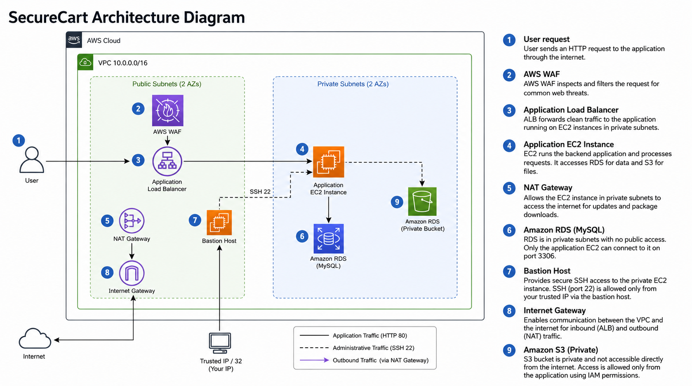

# Project Overview

## Purpose

SecureCart is a personal AWS security architecture lab built to compare two versions of the same environment:

1. an intentionally insecure deployment that exposes common cloud mistakes; and
2. a redesigned environment using network segmentation, private backend resources, least-privilege security-group relationships, encryption, and AWS WAF.

The project is documentation-focused. The small Node.js page exists only to prove that application traffic can reach a private EC2 instance through the load balancer. The repository is not intended to present SecureCart as a software product.

## Scenario

The hypothetical SecureCart platform represents a small e-commerce workload serving more than 10,000 customers. The original architecture prioritizes quick access over secure design: public EC2, public RDS, permissive security groups, and public object storage. Those choices create obvious paths for unauthorized access and data exposure.

The second architecture rebuilds the same scenario around the principle that only components that must be public should be public.

## Project phases

### Phase 1 - Insecure baseline

The baseline intentionally demonstrates:

- public EC2 access;
- global SSH and HTTP exposure;
- public RDS access;
- global MySQL exposure;
- weak self-managed database credentials;
- S3 Block Public Access disabled;
- a public-read S3 bucket policy; and
- anonymous object access.

### Phase 2 - Secure redesign

The secure environment introduces:

- custom VPC `10.0.0.0/16`;
- two public and two private subnets across `us-east-1a` and `us-east-1b`;
- Internet Gateway and NAT Gateway;
- separate public and private route tables;
- internet-facing ALB;
- private EC2 application instance;
- bastion-based SSH path;
- private RDS MySQL instance;
- private S3 bucket with default encryption; and
- AWS WAF managed rule groups associated with the ALB.

## Architecture diagram

The diagram is used as a visual summary of the project rather than a literal AWS placement map. AWS WAF and Amazon S3 are regional services and are not deployed inside VPC subnets; their position in the drawing represents their relationship to the application. The lab separately validates network routing, ALB-to-EC2 reachability, private RDS configuration, private S3 behavior, and WAF blocking. The diagram's S3 application-access relationship is conceptual; an application-to-S3 IAM access test was not captured as part of the project evidence.

## Main security idea

The biggest architectural change is the trust boundary:

- **Before:** users can interact directly with application and data resources.
- **After:** internet traffic enters through the ALB, WAF inspects application requests, EC2 and RDS remain private, administration passes through a controlled bastion path, and private outbound access uses NAT.

This creates multiple independent controls instead of relying on a single firewall rule or security product.
