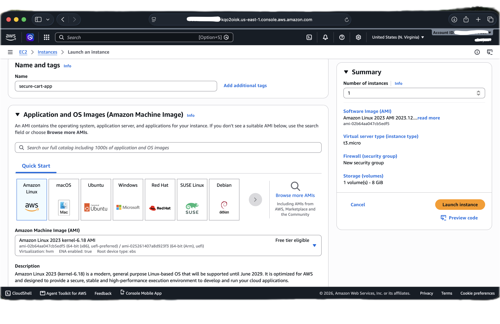
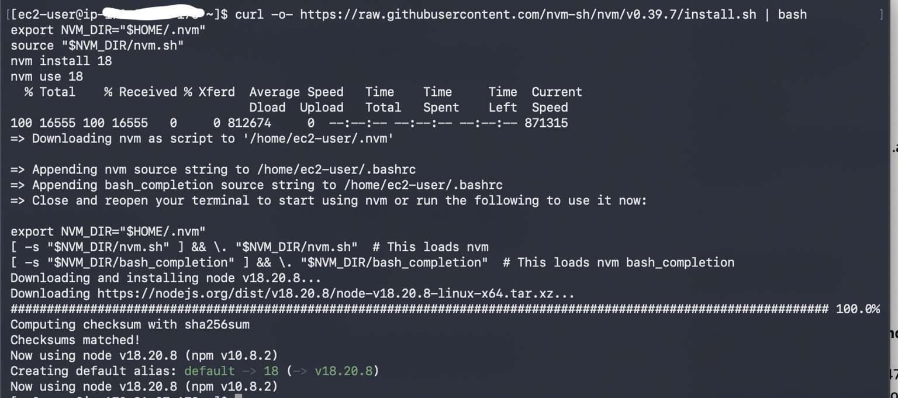
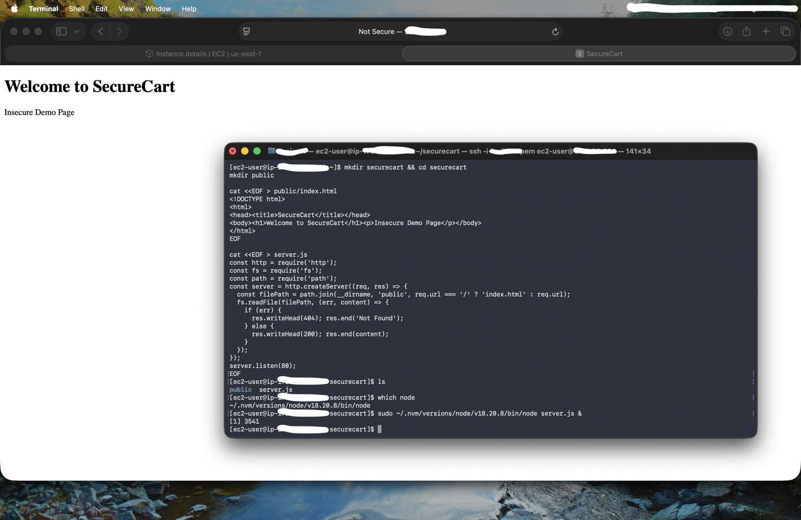
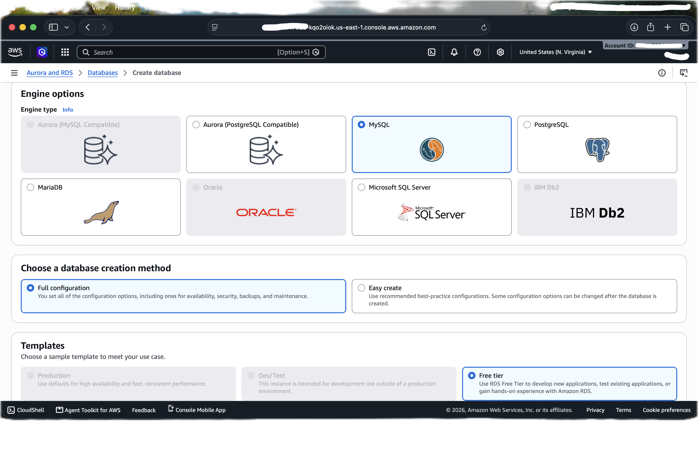
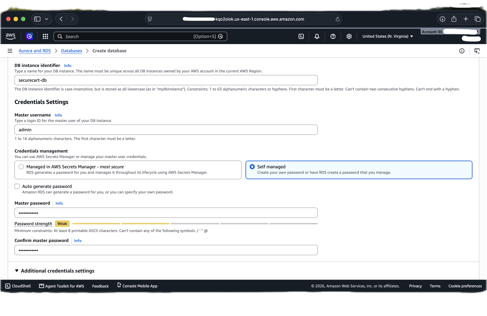
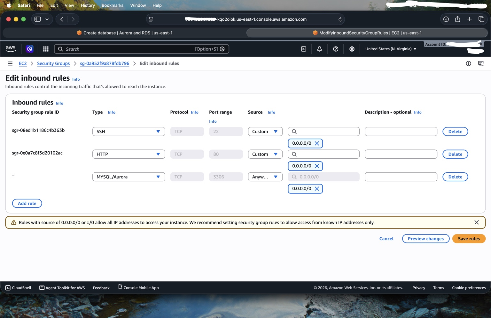
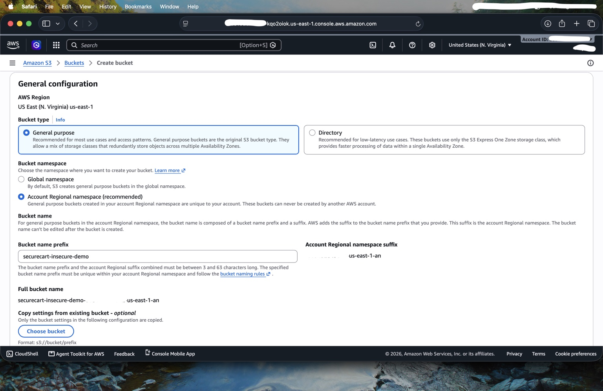
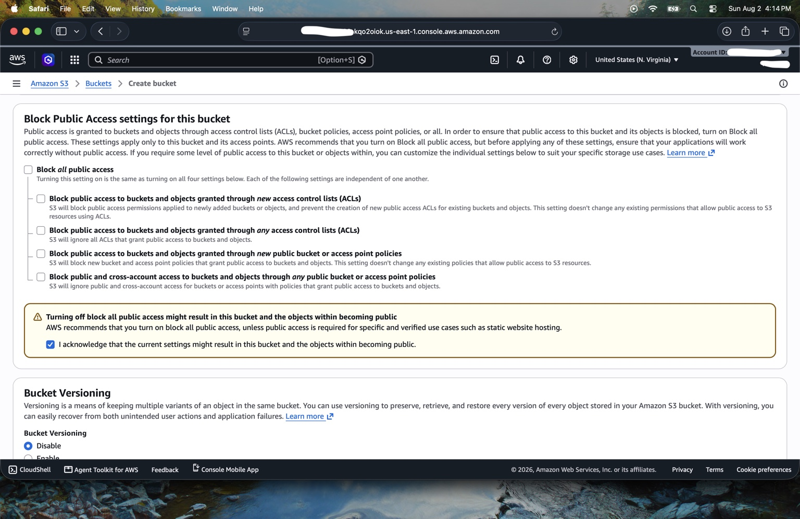
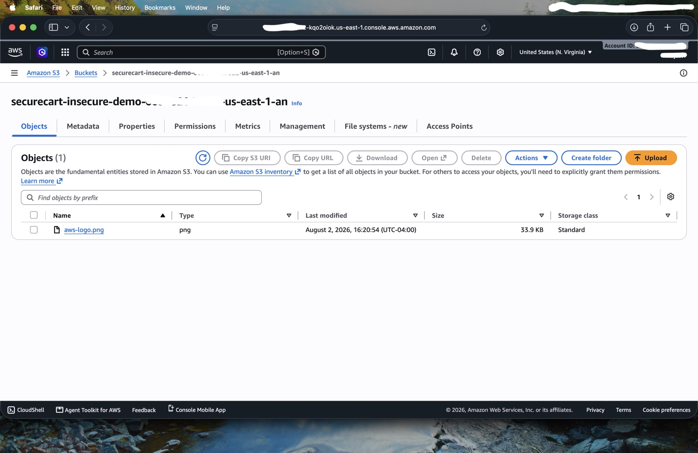

# Insecure Baseline

## Why build the insecure version first?

The insecure phase makes the security redesign easier to understand. Instead of listing AWS best practices in isolation, the project first creates the failure conditions those practices are intended to prevent.

This environment was intentionally short-lived and created only for a controlled lab.

## 1. Public EC2 instance

The initial application instance used Amazon Linux 2023 in the default VPC with public IPv4 assignment enabled.

The security group allowed both SSH and HTTP from anywhere.

### Risk

- TCP `22` from `0.0.0.0/0` exposes SSH to every IPv4 address on the internet.
- TCP `80` from `0.0.0.0/0` exposes the application directly on the instance.
- The EC2 instance itself becomes the internet-facing security boundary.

A `/32` would represent one exact IPv4 address; `0.0.0.0/0` represents the entire IPv4 internet.

## 2. Test application installed directly on the public instance

Node.js was installed so the lab could serve a simple SecureCart page and verify direct public reachability.

The application itself is intentionally minimal. Its only purpose is to provide visible proof of the network path.

## 3. Public RDS instance

The database used MySQL and the free-tier template.

For the insecure demonstration, the master credentials were self-managed with a deliberately weak password.

RDS public access was explicitly enabled in the default VPC.

The network security rules then allowed MySQL/Aurora on TCP `3306` from `0.0.0.0/0`.

### Risk

The database is both publicly addressable and permitted to receive database traffic from arbitrary internet addresses. If valid credentials were obtained, guessed, reused, leaked, or otherwise compromised, there would be no network-layer source restriction to stop the connection.

## 4. Public S3 bucket

The insecure S3 bucket was created for the same region as the application.

Block Public Access was disabled and the warning was acknowledged.

A sample AWS logo object was uploaded.

A bucket policy granted public `s3:GetObject` access using `Principal: "*"`.

Finally, the object URL was opened in a private/incognito browser window and the image loaded without AWS authentication.

### Risk

This is direct evidence that an unauthenticated internet user could retrieve the object. For a real application, the same configuration could expose customer exports, backups, documents, logs, images, or other sensitive assets depending on what the bucket contained.

## Baseline findings

| Finding | Exposure | Severity in this scenario |
|---|---|---|
| SSH open globally | EC2 administrative interface | High |
| HTTP served directly from public EC2 | Application server | Medium / High |
| Public RDS + `3306` from anywhere | Database | Critical |
| Weak self-managed DB credential | Database authentication | High |
| S3 public-read policy | Object storage | Critical for sensitive data |
| No WAF | Public web traffic | Medium |
| No segmentation | Whole environment | High |

The secure rebuild addresses these conditions by changing the architecture rather than simply adding more rules to the same exposed layout.
