# Secure Networking: VPC, Subnets, Gateways and Routing

## Goal

The secure phase starts with the network because placement and routing determine which resources can be reached in the first place.

## 1. Custom VPC

A dedicated VPC was created with CIDR `10.0.0.0/16`.

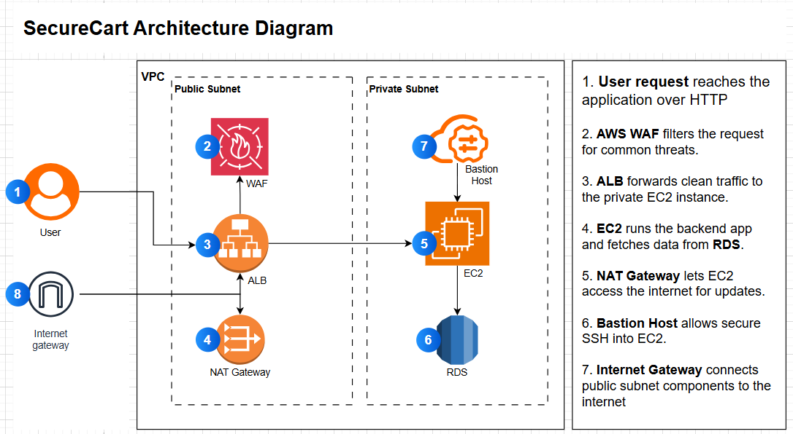

The `/16` provides a large private address space that can be divided into smaller subnets for different tiers.

## 2. Public and private subnet design

| Name | AZ | CIDR | Role |
|---|---|---|---|
| `public-subnet-1` | `us-east-1a` | `10.0.1.0/24` | ALB, NAT Gateway, bastion |
| `public-subnet-2` | `us-east-1b` | `10.0.3.0/24` | ALB |
| `private-subnet-1` | `us-east-1a` | `10.0.2.0/24` | Application / private resources |
| `private-subnet-2` | `us-east-1b` | `10.0.4.0/24` | Private RDS subnet group / private resources |

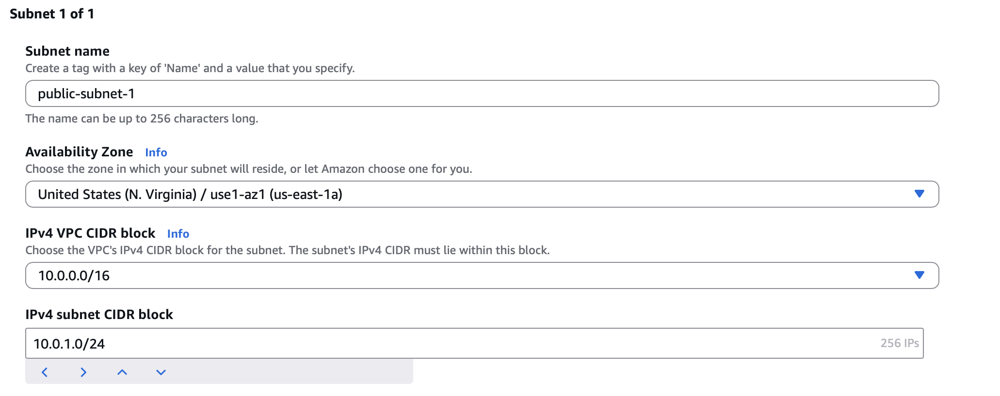

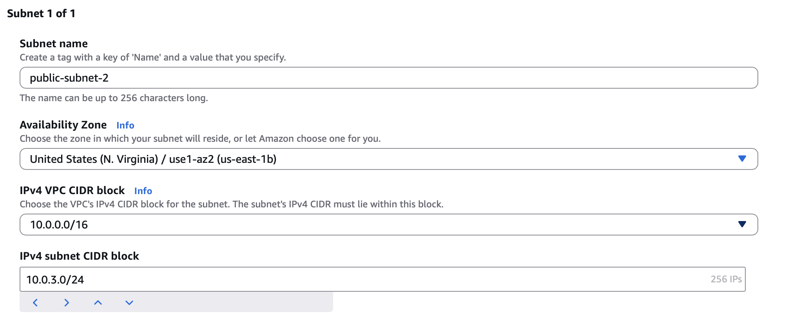

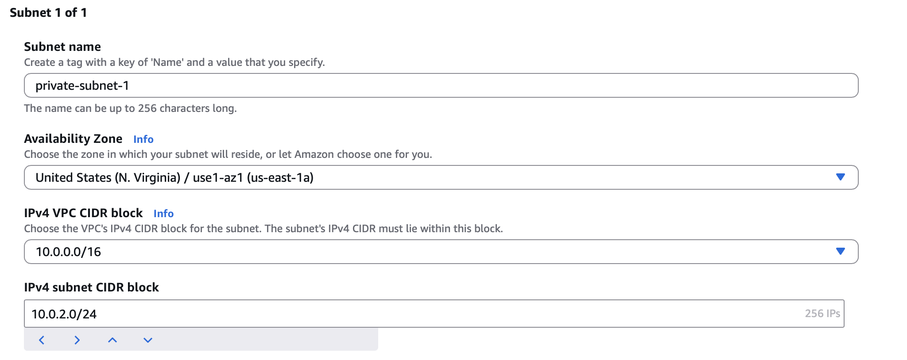

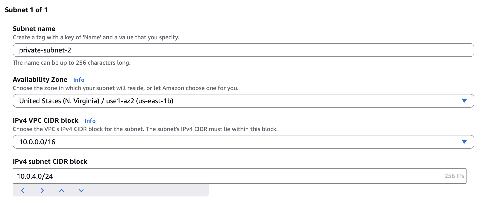

Automatic public IPv4 assignment was enabled for the public subnets.

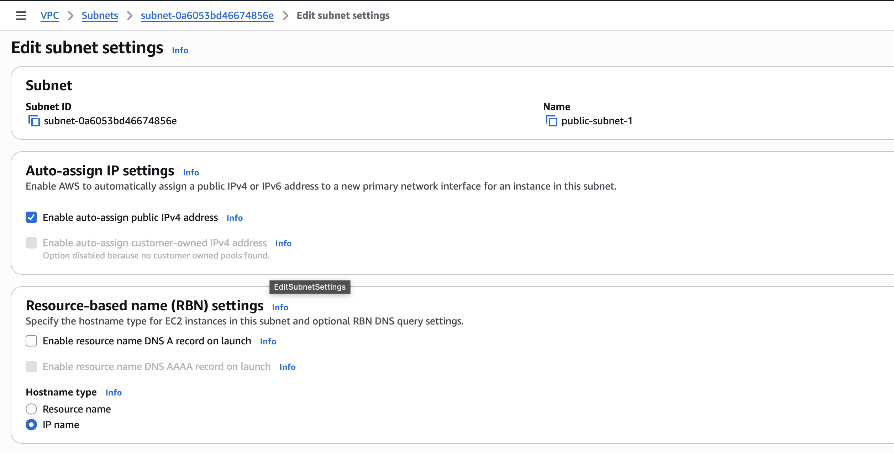

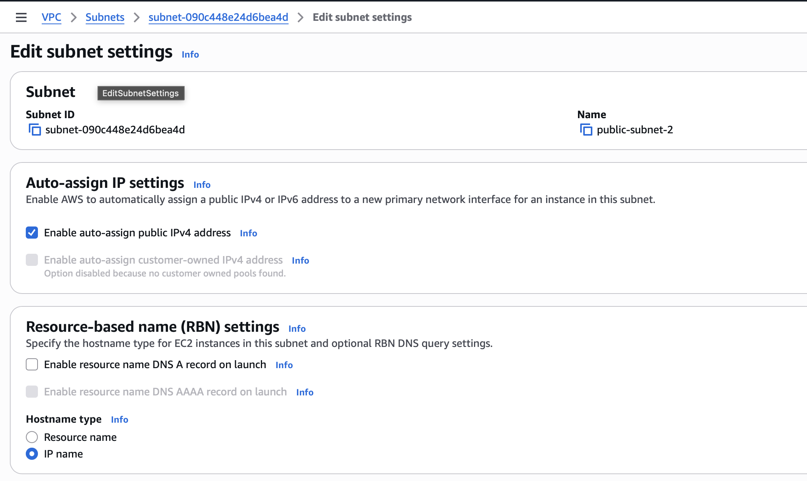

The private subnets were intentionally left without automatic public IP assignment.

## 3. Internet Gateway

The `securecart-igw` Internet Gateway was created and attached to the custom VPC.

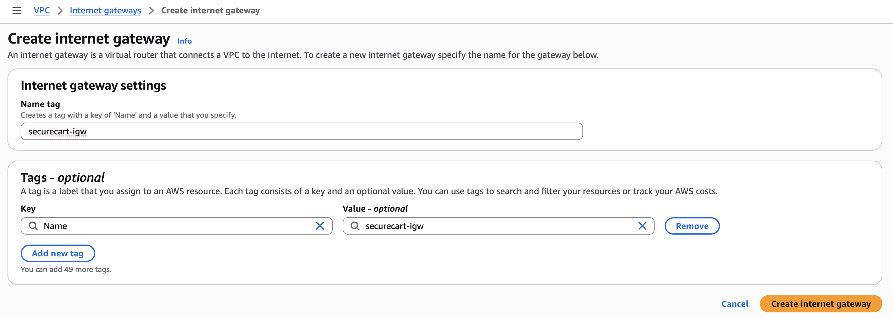

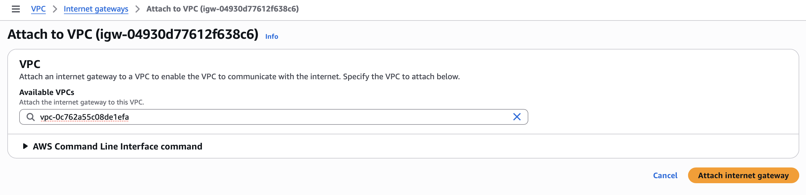

The Internet Gateway is not what makes every resource in the VPC public. A resource also needs the appropriate subnet route, addressing, and security rules.

## 4. NAT Gateway

An Elastic IP was allocated for the public NAT Gateway.

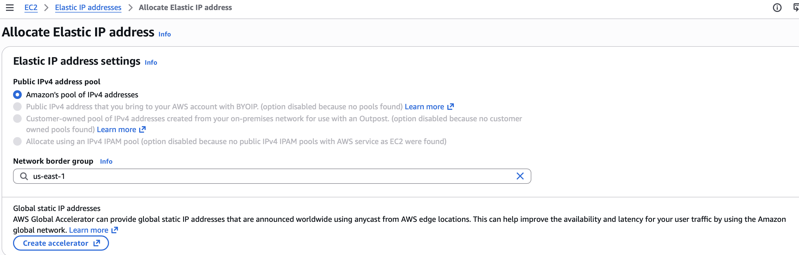

The NAT Gateway was deployed in `public-subnet-1`.

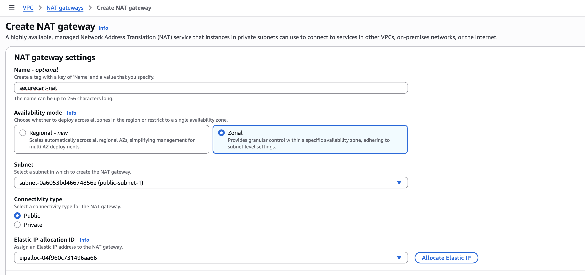

Its job is outbound connectivity for resources in private subnets. It does not create a path for unsolicited inbound internet connections to those private instances.

## 5. Public route table

A `public-rt` route table was created.

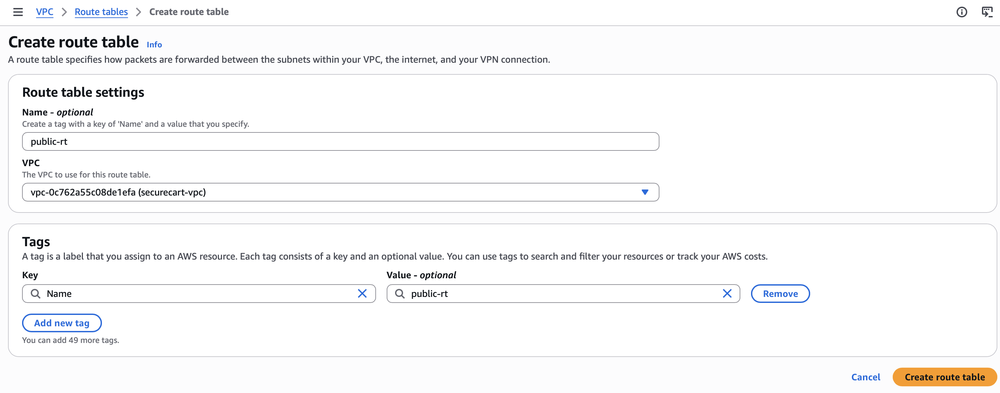

Its internet route sends `0.0.0.0/0` to the Internet Gateway.

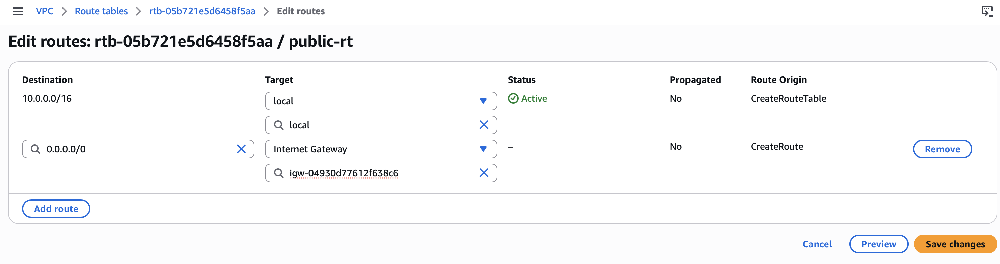

Both public subnets were associated with `public-rt`.

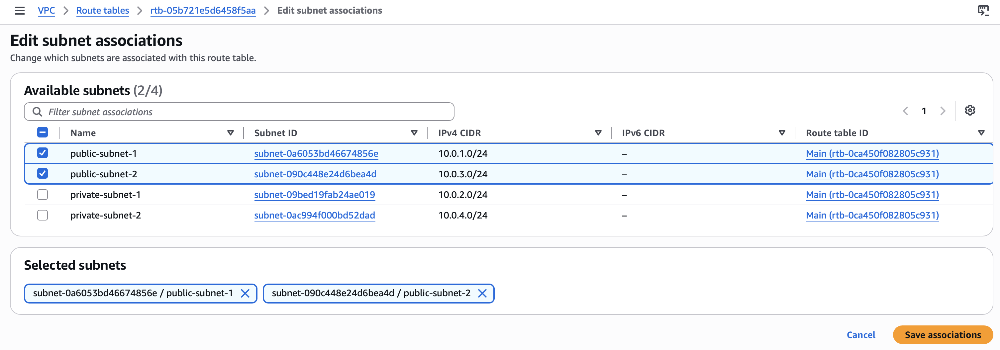

## 6. Private route table

A separate `private-rt` route table was created.

Its default route sends `0.0.0.0/0` to the NAT Gateway instead of directly to the Internet Gateway.

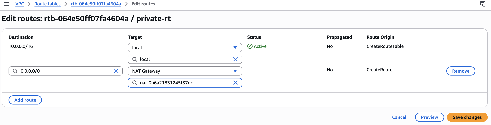

Both private subnets were associated with the private route table.

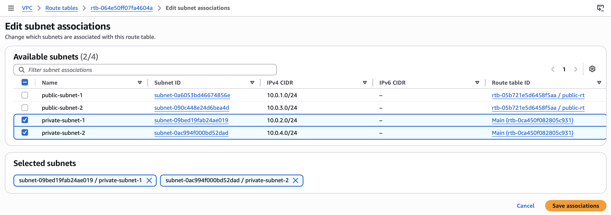

## Result

The networking layer now expresses the intended trust model:

- public-facing resources can live in the public subnets;
- application and database resources can live in private subnets;
- private EC2 can still reach external package repositories through NAT; and
- there is no direct internet route designed for inbound access to the private application or database tiers.

Final AWS VPC resource-map evidence is included later in the validation section.
