# Private Compute, ALB and Bastion Access

## Goal

The application server should run in a private subnet without a public IP. Public users reach it through an Application Load Balancer, while administrative SSH access is handled through a separate bastion path.

## 1. Private application EC2

The `securecart-app` instance used Amazon Linux 2023 and a `t3.micro` instance type.

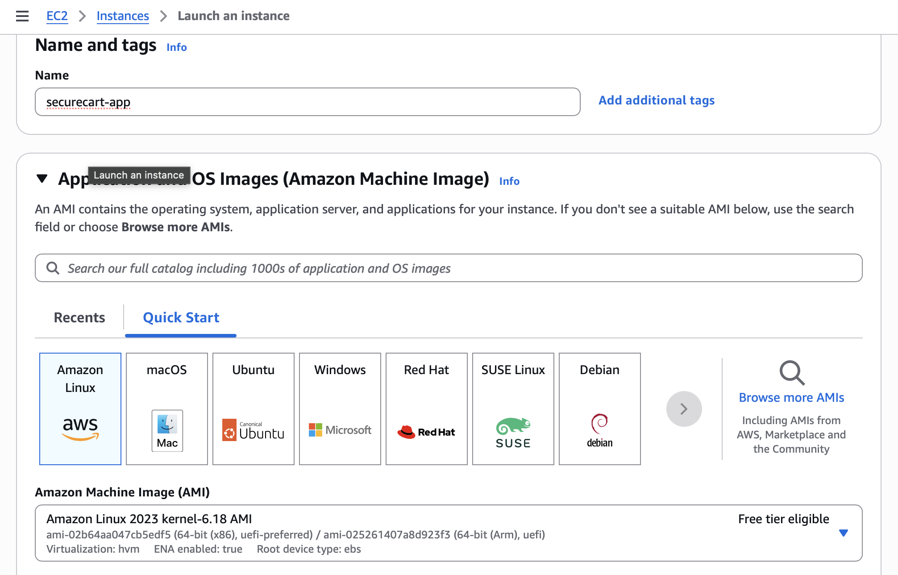

The instance was placed in `private-subnet-1`, and automatic public IPv4 assignment was disabled.

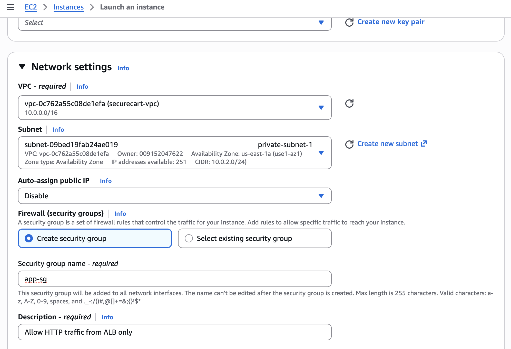

This is the core compute-security change from the baseline: the application server itself is no longer directly internet-addressable.

## 2. Target group

A target group named `securecart-tg` was created for HTTP traffic on port `80`.

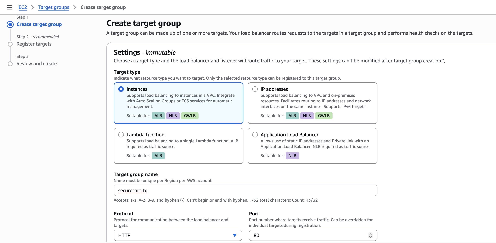

The private application instance was registered as the target.

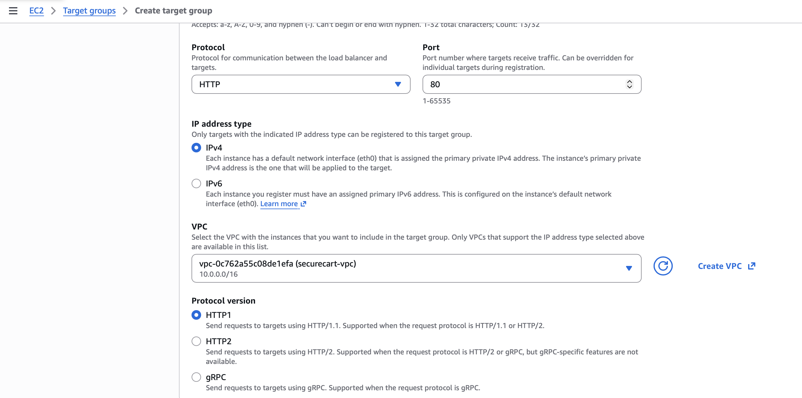

## 3. Application Load Balancer

The ALB security group, `alb-sg`, allows public HTTP traffic on port `80`.

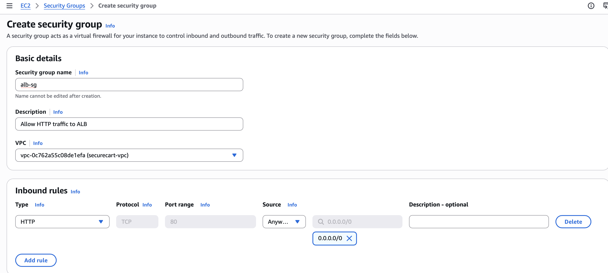

The load balancer was created as internet-facing in `securecart-vpc`.

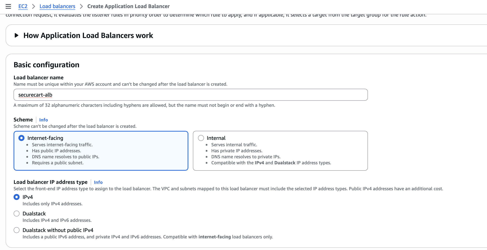

It spans `public-subnet-1` and `public-subnet-2` in separate Availability Zones.

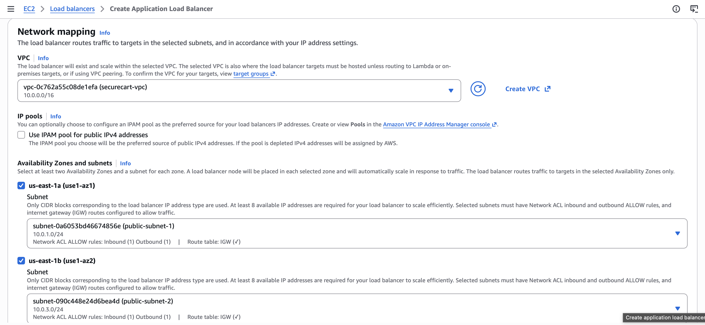

The HTTP listener forwards traffic to `securecart-tg`.

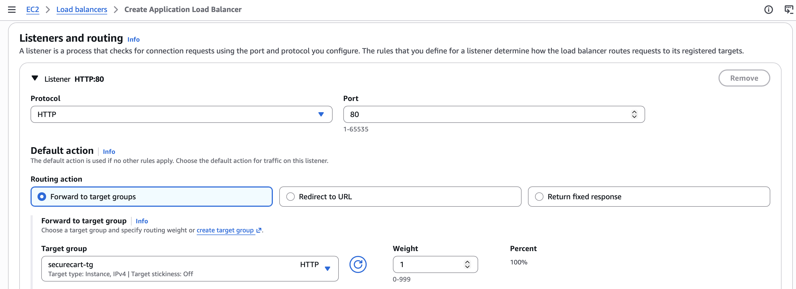

## 4. Restrict application ingress to the ALB

The application security group was updated so HTTP port `80` uses `alb-sg` as the source rather than an internet CIDR.

This matters because an ALB in front of an instance is not enough by itself. If the application security group still allowed `0.0.0.0/0`, the network policy would remain broader than necessary. Referencing `alb-sg` limits the authorized source to resources carrying that security group.

## 5. Bastion host

A bastion security group was created with SSH allowed only from one trusted public IPv4 address using a `/32` CIDR.

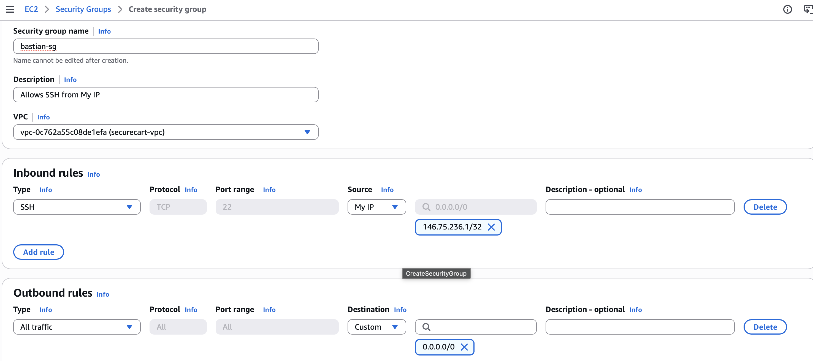

A rule was then added to `app-sg` allowing SSH only from `bastion-sg`.

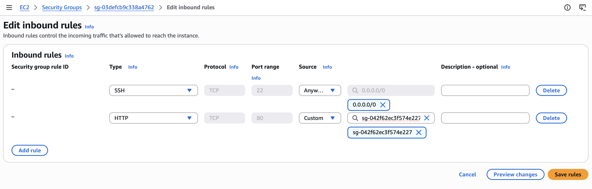

### What `/32` means

A CIDR such as `146.75.236.1/32` represents exactly one IPv4 address. By contrast, `0.0.0.0/0` represents every IPv4 address. Using one trusted `/32` for the bastion's SSH ingress is therefore much narrower than exposing SSH globally.

## 6. SSH path validated

The project copied the key to the bastion for the lab, connected to the bastion, then used the application EC2 private IP to reach the private instance.

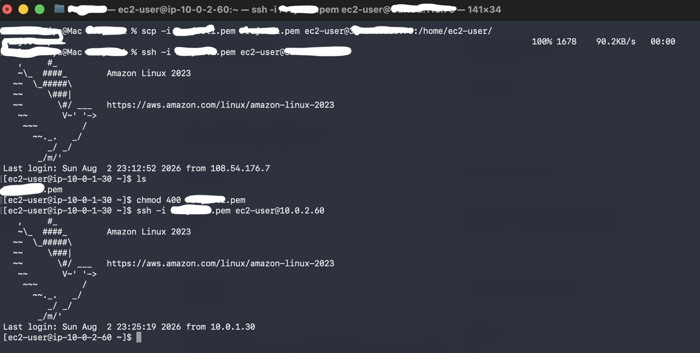

For a production design, copying a private key onto a bastion is not the preferred approach. Session Manager, EC2 Instance Connect Endpoint, agent forwarding, or another managed administrative path would reduce key-handling risk. The screenshot is included because it reflects the actual lab procedure.

## 7. Application validation

Node.js was installed on the private EC2 instance.

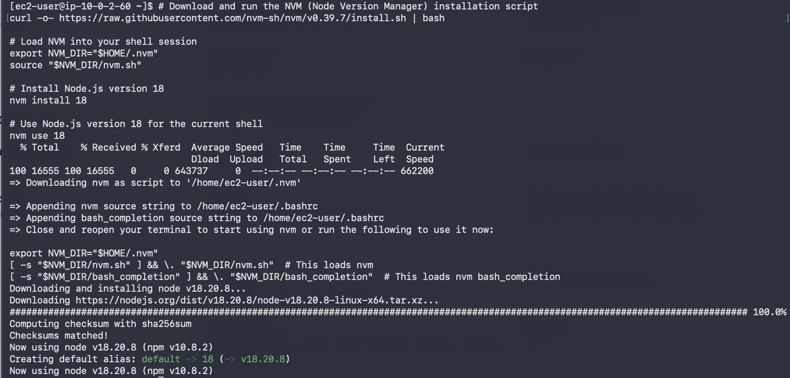

A minimal page and server file were created.

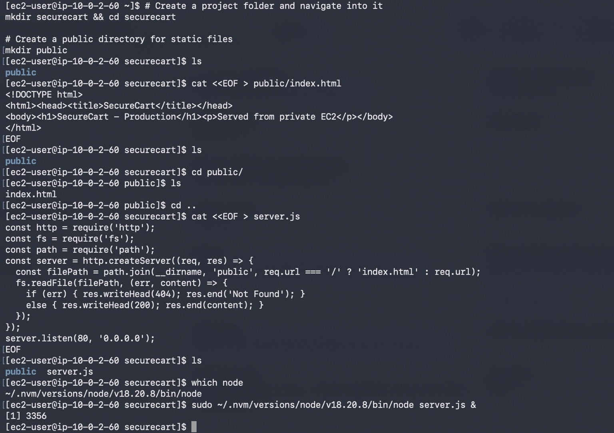

The application was then opened using the ALB DNS name.

This confirms the important network behavior: the browser can reach the application even though the application EC2 instance itself has no public IPv4 address.
