# Secure Data Layer: Private RDS and S3

## RDS

### 1. DB subnet group

A DB subnet group named `securecart-db-subnet-group` was created using the two private subnets across `us-east-1a` and `us-east-1b`.

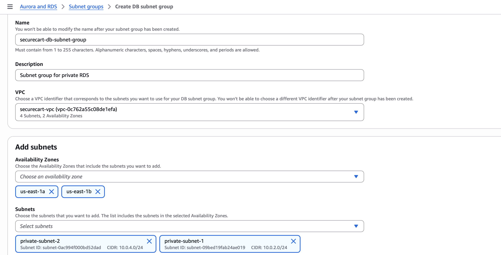

The subnet group gives RDS private subnet choices across multiple Availability Zones even though this lab's database instance itself was not configured as Multi-AZ.

### 2. RDS security group

The `rds-ec2-access` security group allows MySQL/Aurora on TCP `3306` from the application EC2 security group.

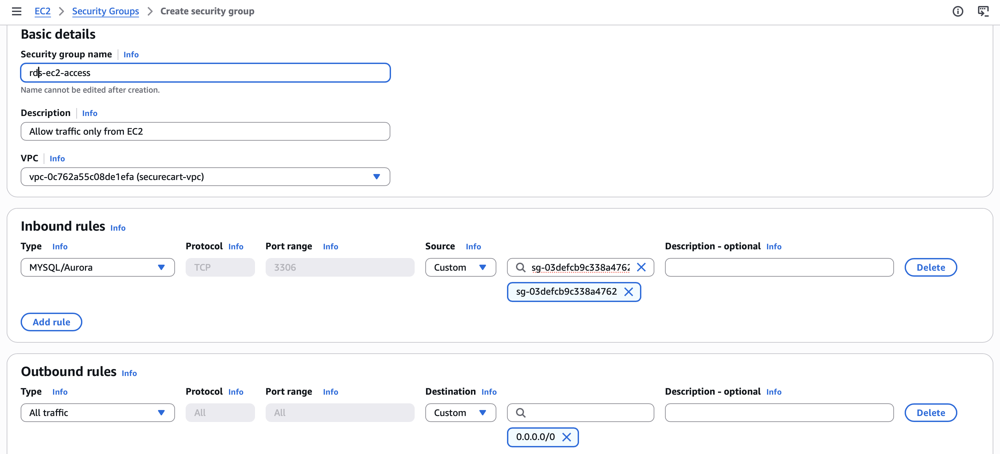

This replaces the insecure baseline rule that allowed database traffic from `0.0.0.0/0`.

### 3. Database configuration

The secure RDS instance used MySQL and the free-tier template.

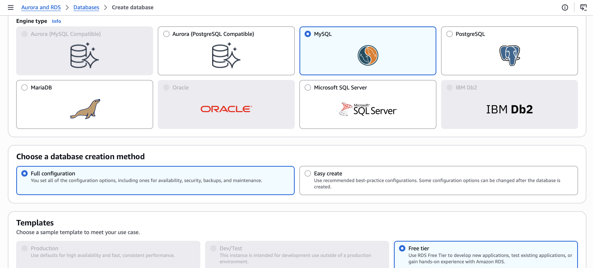

Credentials remained self-managed for the lab.

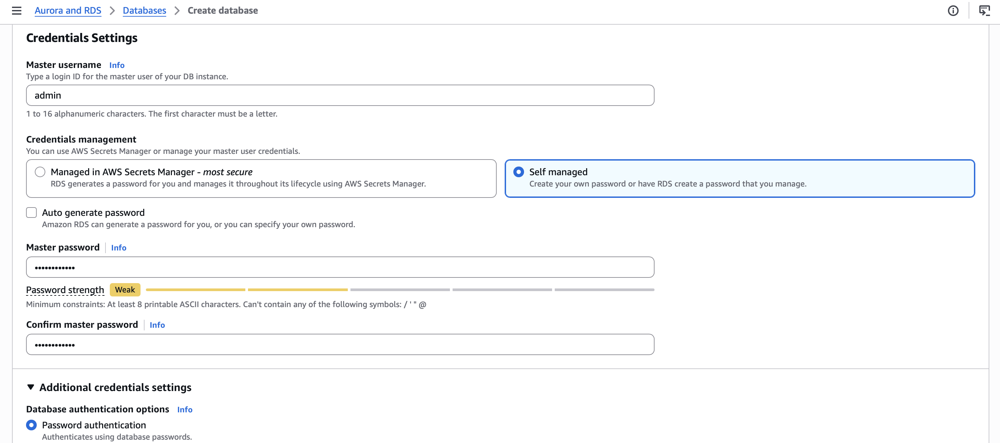

The instance used `db.t3.micro` with General Purpose SSD storage.

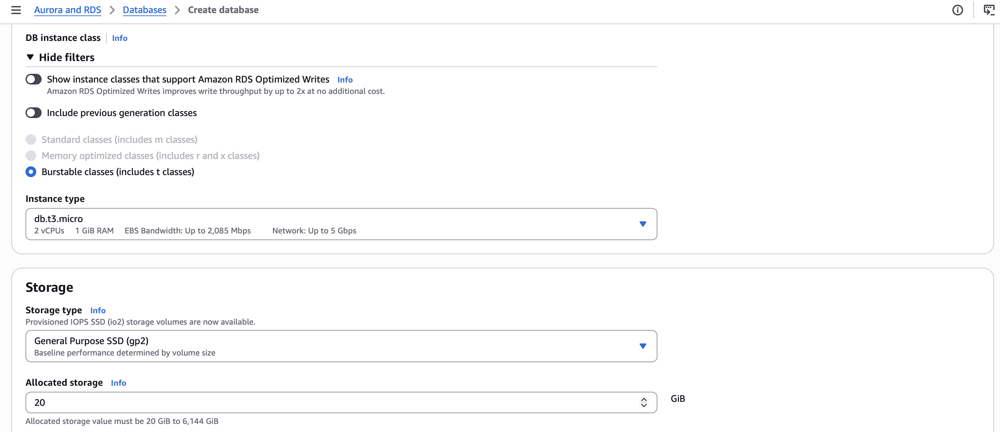

Connectivity was changed to the custom VPC and private DB subnet group with **Public access: No**.

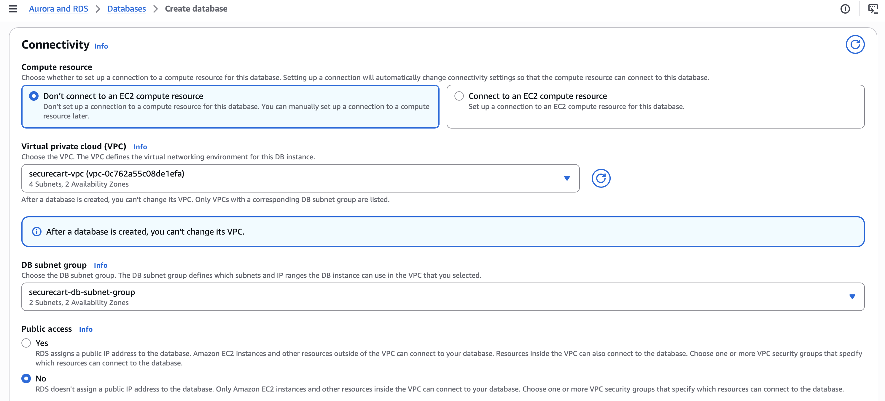

The RDS security group was attached during database creation.

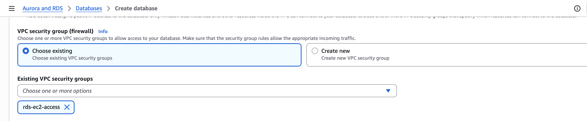

### 4. Encryption validation

The final RDS configuration shows storage encryption enabled and the AWS-managed `aws/rds` KMS key.

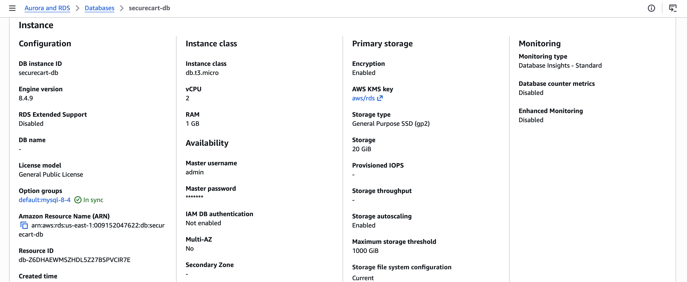

## S3

### 1. Private bucket creation

The secure S3 bucket was created in `us-east-1` for application assets.

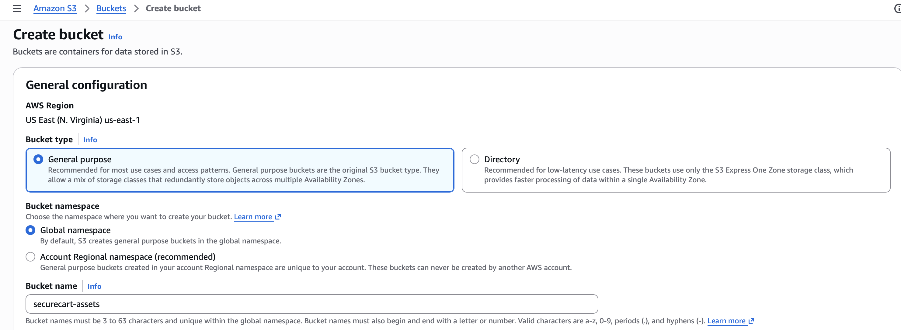

### 2. Block Public Access

All Block Public Access controls were kept enabled.

### 3. Default encryption

Default server-side encryption used Amazon S3 managed keys (SSE-S3).

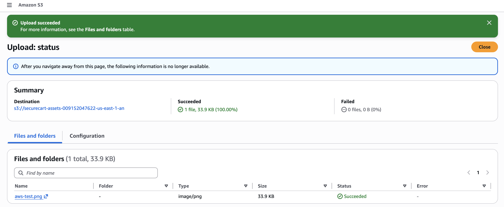

### 4. Anonymous-access validation

A test object was uploaded and its object URL was opened in a private browser window. S3 returned `AccessDenied`.

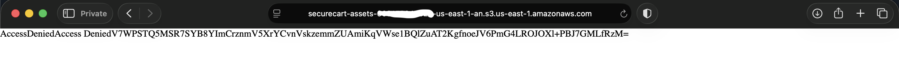

This is the opposite of the insecure baseline, where the test object loaded anonymously.

## Scope note

The S3 control demonstrated here is storage privacy and encryption. The project did not capture an application-to-S3 IAM role/policy integration or prove that the private EC2 instance retrieved the S3 object. That would be a good follow-up enhancement.
