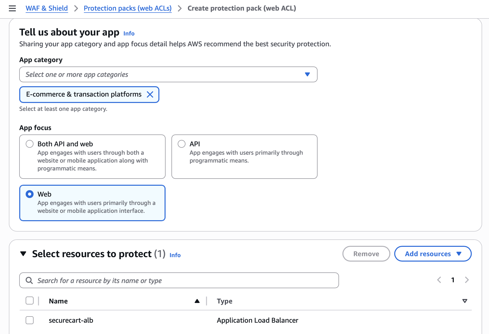
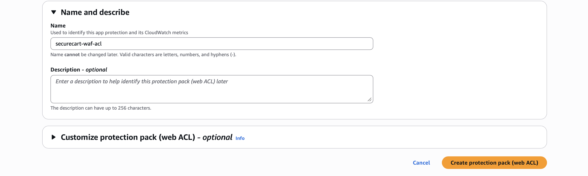
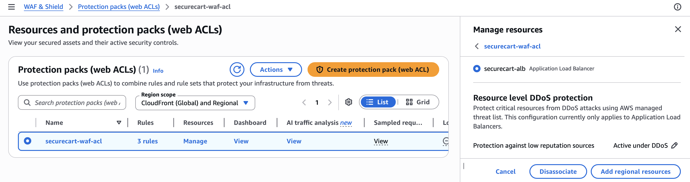
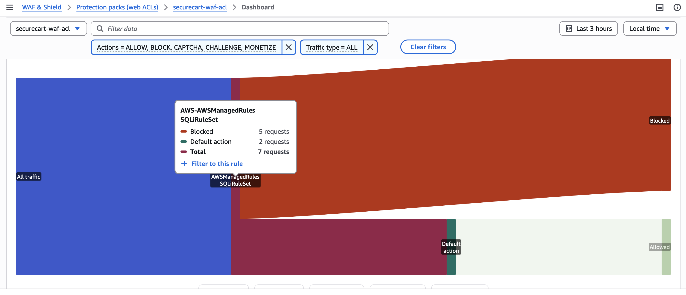
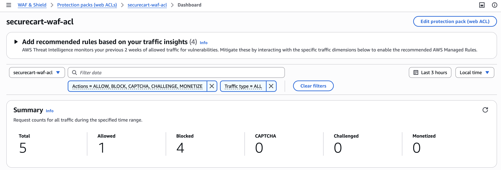
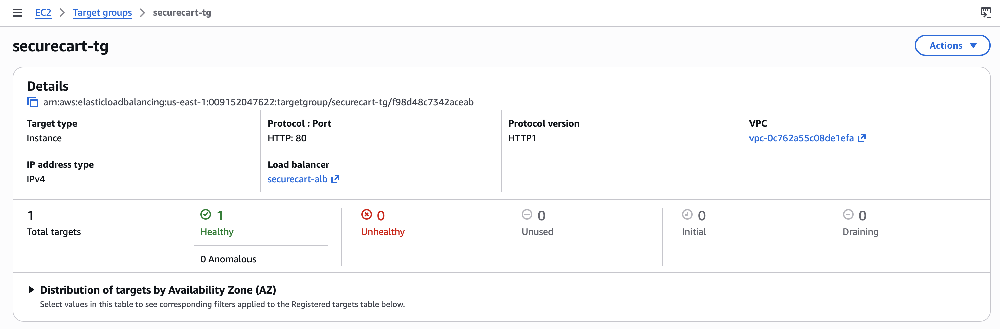
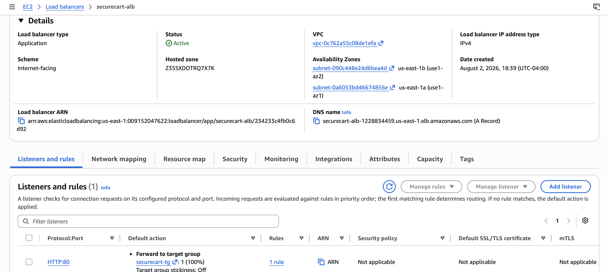
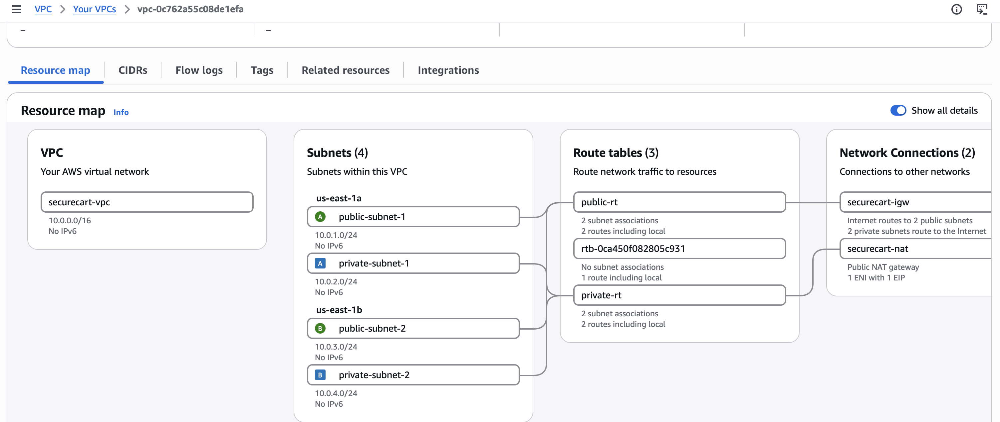
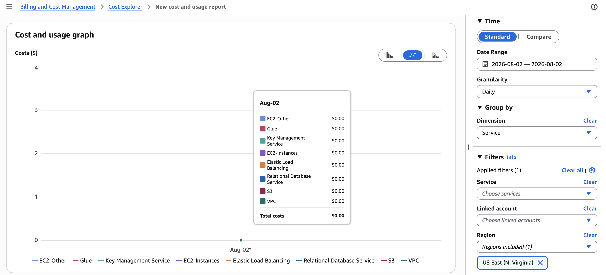
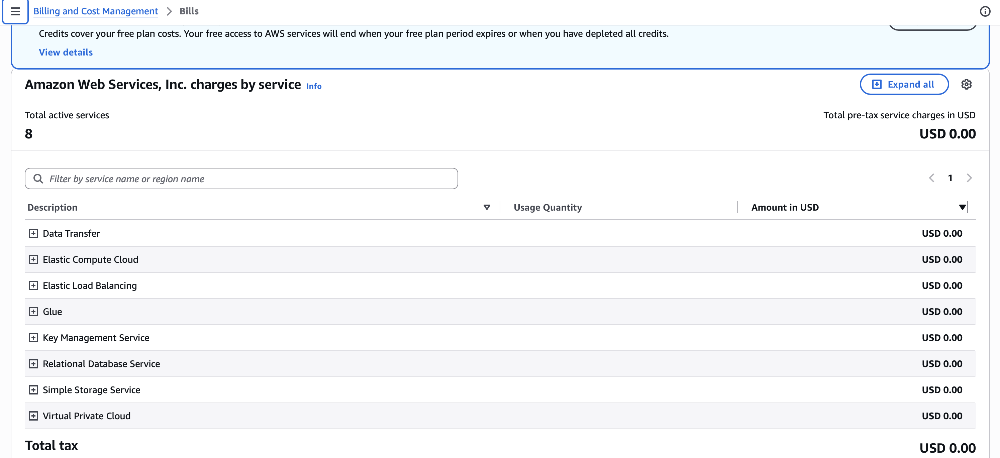

# AWS WAF and Final Validation

## Goal

The final security layer protects the public application entry point from common malicious HTTP patterns before traffic reaches the private EC2 application.

## 1. WAF resource selection

The WAF protection pack / web ACL was created for the SecureCart web application and associated with the Application Load Balancer.

The web ACL was named `securecart-waf-acl`.

## 2. Managed rule groups

The configuration used AWS-managed rule groups including:

- `AWSManagedRulesCommonRuleSet`
- `AWSManagedRulesKnownBadInputsRuleSet`
- `AWSManagedRulesSQLiRuleSet`

These provide managed detection patterns for broadly common web exploits, known malicious inputs, and SQL injection patterns.

## 3. ALB association

The WAF resource-management view shows `securecart-alb` associated with the web ACL.

## 4. WAF dashboard validation

The WAF dashboard recorded allowed and blocked requests.

A controlled SQL-injection-pattern test produced blocked requests attributed to `AWSManagedRulesSQLiRuleSet`.

This is stronger evidence than simply showing that a rule group exists: it demonstrates that WAF evaluated traffic and took a blocking action during the test.

## 5. Target health

The ALB target group shows one healthy target and zero unhealthy targets.

## 6. Active ALB

The load balancer status is Active, internet-facing, and mapped to the two intended public subnets.

## 7. VPC resource map

The AWS VPC resource map shows the four SecureCart subnets, the public and private route tables, the Internet Gateway, and the NAT Gateway.

This is the most useful single screenshot for proving the final segmented network structure.

## 8. Cost evidence

Cost Explorer showed the relevant service categories for the selected project date and region with displayed total cost of `$0.00`.

The Billing console also showed eight active service categories with total pre-tax service charges of `USD 0.00` at capture time.

The account banner indicates credits were covering eligible costs. For that reason, `$0.00` should be described as the **displayed billed amount during the lab**, not as the normal price of operating this architecture.
